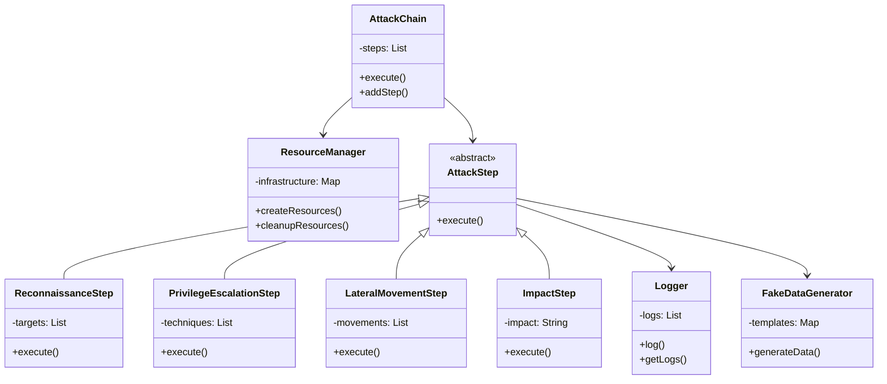

# Mining the Cloud: Attack Chain Simulation

## Slide 5: System Architecture

### Key Components:
- **AttackChain**: Orchestrates the entire attack simulation
- **ResourceManager**: Manages cloud infrastructure resources
- **Attack Steps**: Modular components for different attack phases
- **Support Services**: Data generation and logging utilities 